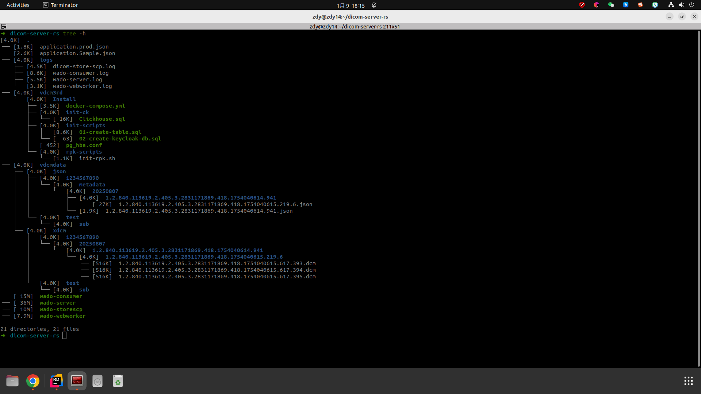
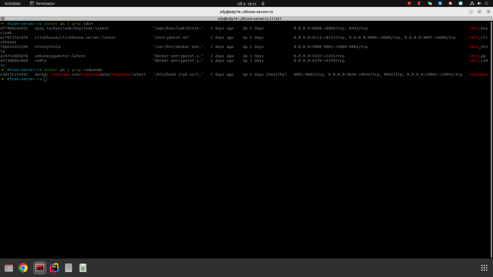
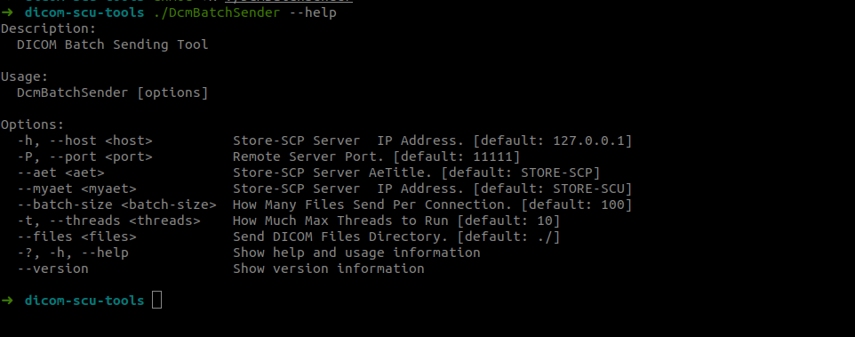
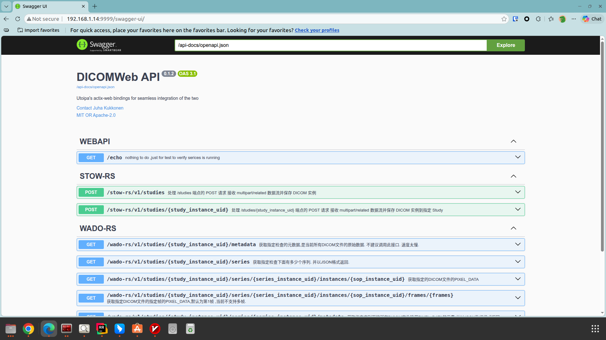

### how to deploy dicom-server-rs

To deploy `dicom-server-rs`, follow these steps:

- Git Clone Project from GitHub

- ***cargo build --release***

- copy wado-server wado-storescp wado-consumer wado-webworker to $USER_HOME/dicom-server-rs

- create  application.prod.json from Sample File : application.Sample.json

- check docker-service state 

Deploy Result is like this:

 

